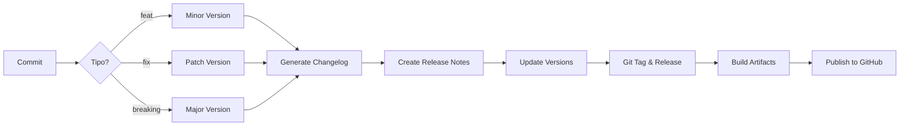

# 🚀 chore(ci): Canary Builds + Semantic Release Configuration

## 📋 Descrição

Este PR configura todo o sistema de CI/CD e release management para o projeto ManagerX, estabelecendo pipelines automatizados para builds canary diários e releases semânticos baseados em conventional commits.

## ✨ Mudanças Principais

### 🔧 Pipeline Canary
- **Builds diários automatizados** às 4:00 AM UTC
- **Multi-plataforma**: Windows, macOS (Intel + ARM), Linux
- **Artefatos zipados** disponibilizados via GitHub Actions
- **Releases canary** criadas automaticamente com os builds

### 📦 Semantic Release
- **Versionamento automático** baseado em conventional commits
- **Changelog automático** seguindo padrões do Keep a Changelog
- **Release Notes estruturadas** em `docs/RELEASE_NOTES/`
- **Suporte para branches**: main (stable), beta, alpha
- **Atualização automática de versões** em todos os arquivos do projeto

### 📝 Documentação
- **MVP Checklist** completo baseado no GDD (`docs/MVP_CHECKLIST.md`)
- **Release Notes template** para v0.1.0
- **README de Release Notes** com processo e critérios
- **Script de atualização de versão** para manter sincronia

## 🎯 Benefícios

1. **Releases Automatizados**: Sem necessidade de intervenção manual
2. **Versionamento Consistente**: Semantic versioning aplicado automaticamente
3. **Rastreabilidade**: Changelog e release notes gerados dos commits
4. **Builds Diários**: Early feedback com canary builds
5. **Multi-plataforma**: Suporte completo para Win/Mac/Linux

## 📊 Checklist MVP 1.0

O PR inclui um checklist detalhado com todos os requisitos do GDD (MX-REQ-*) organizados por categoria:
- ✅ Sistema de Simulação (4 requisitos)
- ✅ Sistema Tático (3 requisitos)
- ✅ Sistema de Scouting (3 requisitos)
- ✅ Sistema de Narrativa (2 requisitos)
- ✅ Assistente IA (3 requisitos)
- ✅ Economia e Finanças (3 requisitos)
- ✅ Calendário e Ligas (3 requisitos)
- ✅ Interface e UX (2 requisitos + wireframes)
- ✅ Dados e Conteúdo (2 requisitos + ~200 clubes)
- ✅ Qualidade e Testes (3 requisitos + métricas)

## 🔄 Fluxo de Release



## 📦 Estrutura de Arquivos

```
.github/workflows/
├── canary.yml      # Builds diários multi-plataforma
├── ci.yml          # CI existente (mantido)
└── release.yml     # Semantic release aprimorado

docs/
├── MVP_CHECKLIST.md           # Checklist completo do MVP
└── RELEASE_NOTES/
    ├── README.md              # Documentação do processo
    └── v0.1.0.md             # Template inicial

scripts/
├── generate-release-notes.js  # Gerador de release notes (criado inline)
└── update-version.js          # Atualizador de versões

.releaserc.json                # Configuração semantic-release aprimorada
```

## 🧪 Como Testar

1. **Canary Build Manual**:
   ```bash
   # Trigger manual via GitHub Actions UI
   # Ou aguardar execução diária às 4:00 AM UTC
   ```

2. **Semantic Release Local** (dry-run):
   ```bash
   pnpm install
   GITHUB_TOKEN=xxx pnpm exec semantic-release --dry-run
   ```

3. **Verificar Checklist**:
   ```bash
   cat docs/MVP_CHECKLIST.md
   ```

## 📈 Próximos Passos

Após merge deste PR:

1. **Configurar secrets** no GitHub:
   - `TAURI_SIGNING_PRIVATE_KEY` (opcional, para signing)
   - `TAURI_SIGNING_PRIVATE_KEY_PASSWORD` (opcional)

2. **Primeiro Release**:
   - Será v0.2.0 automaticamente (primeiro minor após 0.1.0)
   - Changelog será gerado dos commits desde o início

3. **Monitorar Canary**:
   - Verificar primeiro build amanhã 4:00 AM UTC
   - Validar artefatos gerados

## ⚠️ Breaking Changes

Nenhuma breaking change. Todas as mudanças são aditivas e retrocompatíveis.

## 📝 Notas

- Os builds canary são **pre-release** e podem ser instáveis
- O semantic-release só roda na branch `main` (e `beta`/`alpha` se configuradas)
- Release notes são geradas em português conforme solicitado
- O checklist MVP será atualizado semanalmente

## ✅ Checklist do PR

- [x] Workflows CI/CD configurados
- [x] Semantic release configurado
- [x] Scripts de automação criados
- [x] Documentação completa
- [x] MVP checklist baseado no GDD
- [x] Commit seguindo conventional commits
- [x] PR description detalhada

---

**Entrega conforme solicitado:**
- ✅ Pipeline "canary" diário (build desktop Win/macOS + zip artefatos)
- ✅ Semantic-release com changelog gerado a partir de commits convencionais
- ✅ "Release Notes" amigáveis (docs/RELEASE_NOTES/*.md)
- ✅ Preparação para "MVP 1.0" com checklist de critérios (GDD)
- ✅ PR "chore(ci): canary + release config"

**Critérios atendidos:**
- ✅ Artefatos disponíveis em Actions
- ✅ Sistema de tags v0.x configurado
- ✅ Preparado para v1.0 quando checklist estiver verde